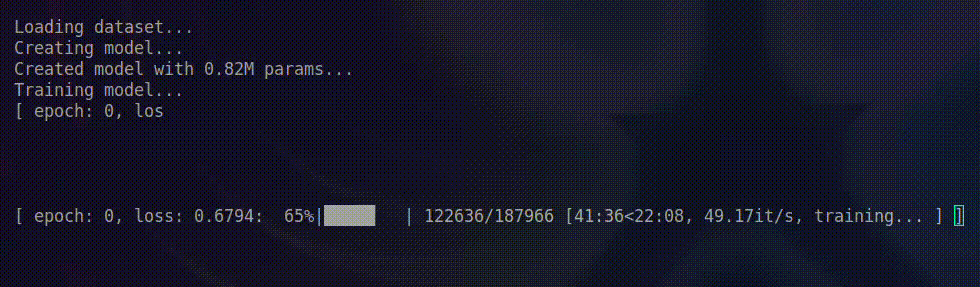
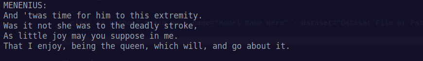

[](https://quicksticks-oss.github.io/LFAI/docs/pages)
[](https://colab.research.google.com/drive/1znKbTH6ORQKMPSknFjpiBtQRd2_l-wZx?usp=sharing)

# About

This GitHub repository hosts an innovative project featuring an LSTM-based embedding GPT-like neural network. This network is designed to fuse diverse data modalities such as images, audio, sensor inputs, and text, creating a holistic and human-like sentient AI system with the ability to comprehend and respond across multiple data formats.

## Models V1

- [Chat Medium](https://huggingface.co/Quicksticks-oss/LFAI/blob/main/chat-lstm-10.38M-20230824-4-512-ctx512.pth)
- [Shakespeare Small](https://huggingface.co/Quicksticks-oss/LFAI/blob/main/Shakespeare-0.8M-20230820-6-128-ctx128.pth)

## Models V2

 - [Books Small](https://huggingface.co/Quicksticks-oss/LFAIv2/resolve/main/LFAI-books-ctx512-2m.pth)
   
## Screenshots




## Documentation

[Documentation V1](docs/DOCUMENTATION.md)

## Usage/Examples

### Inference V2
Just open the script `inference.py` and change the `MODEL` and `DEVICE` variable if needed and then run the script.

### Inference V1
```python
from inference import Inference

if __name__ == '__main__':
    inference = Inference('Model Path Here')
    output, hidden = inference.run('MENENIUS:')
    print(output)
```

### Training Simple LFAI V1
```shell
clear && python3 train.py --name="Model Name Here" --dataset="Dataset File or Path here" --contextsize=128
```

### Training Simple LFAI V2
All training settings can be set in the `TRAIN_SETTINGS.py` script.
The main settings you want to pay attention to are `TEXT_DATASET` and `max_iters`.
`TEXT_DATASET` is the file path that contains all of yor utf-8 or ascii text. This could be for example [Tiny Shakespeare](https://raw.githubusercontent.com/karpathy/char-rnn/master/data/tinyshakespeare/input.txt).
`max_iters` is how many itterations through the dataset you would like to run. I would reccoment setting this to a variable like `5000` if you have a lower teir GPU or CPU but if you have a high teir GPU I would set it to `25000` or `50000`.

### Finetuning V2
If you want to finetune a dataset all you need to do is set `FINETUNE` to `True` and set `LOAD_FILE` to the model you want to finetune.

## Roadmap

- ~~Train More Public Models~~

- ~~Additional networks like GRU~~

- Add online model inference.

- Add v5

- ~~Use last token as new token in inference~~

- Add more integrations

## License

[Non-Share and Non-Modify License](LICENSE.MD)


## Authors

- [@QuickSticks-oss](https://github.com/Quicksticks-oss)

